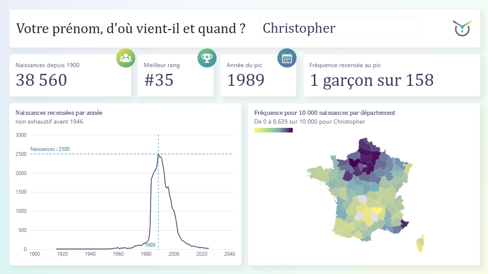

# Prénoms français, 1900-2025

Un rapport Power BI sur 125 ans de prénoms en France, construit sur un pipeline
Python et DuckDB testé et reproductible à l'identique.

<!-- CAPTURE : page 1, avec un prénom parlant plutôt que la valeur par défaut -->


---

## Ce que montre le rapport

| page | question |
|---|---|
| Et le vôtre ? | à quoi ressemble la trajectoire d'un prénom, et où il est le plus fréquent |
| Y a-t-il encore des prénoms courants ? | quels prénoms dominaient une période et un territoire, et comment la diversité a évolué |
| Quels prénoms sont d'ici ? | quels prénoms sont caractéristiques d'un département, et lesquels ont la composition la plus singulière |
| Notes de méthode | ce que les données ne disent pas |

## Les données

- 87 644 320 naissances, 1900 à 2025
- 52 340 prénoms, dont 3 177 portés par les deux sexes
- 101 départements, 80 212 545 naissances localisées, soit 91,5 % du national
- source : fichier des prénoms de l'Insee, millésime 2025

## Le pipeline

Cinq étapes, un module partagé, onze fichiers Parquet en sortie.

| fichier | rôle |
|---|---|
| `01_download.py` | télécharge les sources déclarées, écrit `manifeste.json` |
| `02_build.py` et `.sql` | socle national, schéma en étoile |
| `03_traits.py` et `.sql` | profils normalisés et six traits de forme |
| `04_archetypes.py` | classification en cinq groupes |
| `05_geographie.py` et `.sql` | niveau départemental et indice de spécificité |
| `provenance.py` | vérifie l'empreinte des sources contre le manifeste |

Reproduire :

```bash
uv sync
uv run python src/01_download.py
uv run python src/02_build.py
uv run python src/03_traits.py
uv run python src/04_archetypes.py
uv run python src/05_geographie.py
uv run pytest -q
```

Le pipeline est idempotent bit à bit : deux exécutions produisent des fichiers
identiques. La suite compte 48 tests, dont plusieurs comparent les sorties à la
source plutôt qu'à elles-mêmes.

Les sorties sont versionnées dans `data/out`. N'importe qui peut donc recalculer
les chiffres annoncés ici sans rien télécharger chez l'Insee.

## Décisions de méthode

**Le grain est le couple prénom-sexe.** Jamais le prénom seul, sous peine de
fusionner 3 177 prénoms mixtes.

**L'indice de spécificité stocke deux colonnes, pas un ratio.** Un rapport ne
s'additionne pas : la moyenne des indices de deux départements ne vaut pas
l'indice de leur regroupement. En stockant l'observé et l'attendu, la division
se fait au niveau où le lecteur regarde et reste juste à toute maille.

**L'univers de référence est explicite.** Observé et attendu sont calculés dans
le seul monde départemental. Les mélanger aux totaux nationaux biaiserait tous
les indices d'environ 9 % sans que rien ne le signale.

**La couverture départementale n'est pas constante.** Le seuil de publication
de l'Insee écarte les couples sous 5 naissances, et cette censure mord d'autant
plus fort que la diversité des prénoms augmente : 96,4 % de couverture sur
1900-1924, 80,7 % sur 2000-2024. La diversité et la concentration sont donc
calculées au niveau national, pas départemental.

**La géographie est celle du dernier millésime.** Les départements 92, 93 et 94
portent des effectifs dès 1964, avant leur création en 1968. Les comparaisons
sont homogènes sur toute la période.

**Trois indicateurs distincts, définis séparément.** La fréquence pour 10 000
répond à « ce prénom est-il courant ici ». L'indice de spécificité, un quotient
de localisation, répond à « ce prénom est-il d'ici ». Le score départemental
mesure l'écart entre la composition de prénoms d'un département et la moyenne
nationale. Marie est fréquente partout et spécifique nulle part ; Toussainte est
rare partout, y compris en Corse, et pourtant spécifique de la Corse.

## Limites

- Effectifs arrondis au multiple de 5, aucun couple publié sous 5 naissances.
- Exhaustivité non garantie avant 1946. Les 87,6 millions ne sont pas le nombre
  de naissances en France sur la période.
- L'échelle de couleur de la carte de la page 1 est propre au prénom affiché.
- Un prénom entièrement concentré dans un département atteint mécaniquement
  l'indice maximum, d'où le filtre appliqué au classement de la page 3.
- Chaque niveau géographique est arrondi au multiple de 5 indépendamment : la
  somme des départements ne retombe pas sur le total national. Gabriel compte
  4 625 naissances en 2025 au niveau France, 4 645 en sommant les départements.
- Les classements régionaux agrègent les données départementales. Le niveau
  régional publié par l'Insee couvre 84,8 millions de naissances contre 80,2 :
  le choix retenu garantit qu'un total régional est exactement la somme des
  départements affichés ailleurs, au prix de cinq points de couverture.

## Ouvrir le rapport

Télécharger `tableau_de_bord/prenoms_france.pbix` et l'ouvrir avec Power BI
Desktop. Le fichier embarque les données, il fonctionne tel quel. Aucune version
en ligne n'est publiée, faute de licence.

Pour actualiser le modèle depuis les Parquet du dépôt, régler le paramètre
`DossierDonnees` sur le chemin local de `data/out`, par Transformer les données,
Gérer les paramètres.

## Sources et licences

- Fichier des prénoms, Insee, millésime 2025, [Licence ouverte](https://www.etalab.gouv.fr/licence-ouverte-open-licence/)
- Contours départementaux, IGN Admin Express, tracés du millésime 2018, Licence ouverte, dans `geo/`
- Code officiel géographique, Insee, millésime 2026
