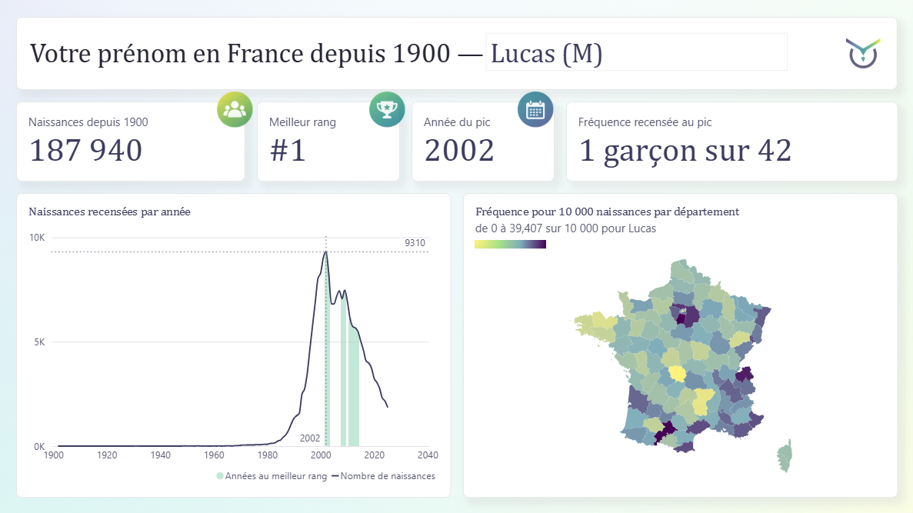
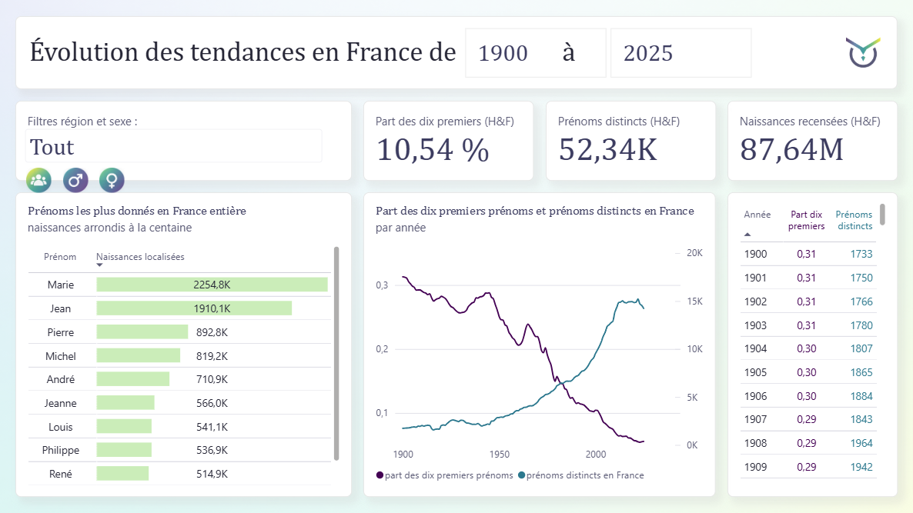
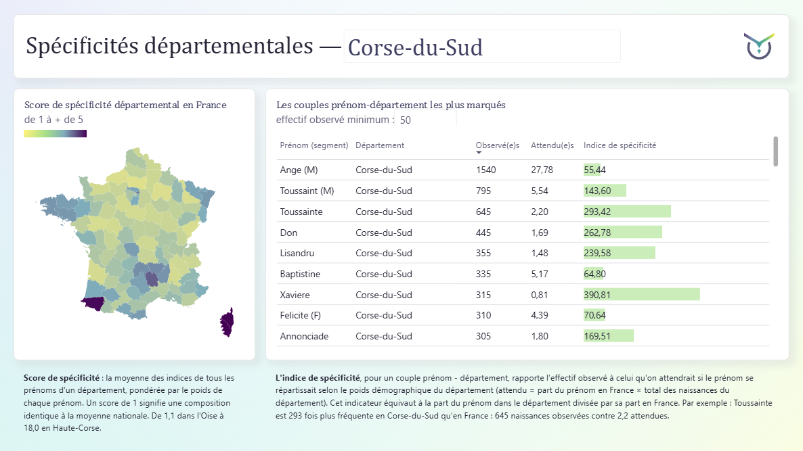

# Prénoms français, 1900-2025

Un rapport Power BI des prénoms en France de 1900 à 2025, construit via un pipeline
Python et SQL (DuckDB) reproductible.





---

## Ouvrir le rapport

Télécharger `tableau_de_bord/prenoms_france.pbix` et l'ouvrir avec Power BI
Desktop ou Power BI service (navigateur). Le fichier fonctionne tel quel. Aucune version en ligne n'est publiée, faute de licence.

## Ce que montre le rapport

| page | question |
|---|---|
| 1 | Votre prénom est-il (a-t-il) été populaire en France ? |
| 2 | Quels ont-été les tendances depuis 1900 ? |
| 3 | Existe-t-il de spécificités départementales marquées ? |
| Notes de méthode | infos sur les sources, les indicateurs et les limites |

## Les données

- 87 644 320 naissances, 1900 à 2025
- 52 340 prénoms, dont 3 177 portés par les deux sexes
- 101 départements, 80 212 545 naissances localisées, soit 91,5 % du national
- source : fichier des prénoms de l'Insee, millésime 2025

## Le pipeline

Python et SQL, cinq étapes, 12 fichiers (tables) Parquet en sortie.

| fichier | rôle |
|---|---|
| `01_download.py` | télécharge les sources déclarées, écrit `manifeste.json` |
| `02_build.py` et `.sql` | socle national, schéma en étoile |
| `03_traits.py` et `.sql` | profils normalisés et six traits de forme |
| `04_archetypes.py` | classification en cinq groupes (en construction) |
| `05_geographie.py` et `.sql` | niveau départemental et indice de spécificité |
| `provenance.py` | vérifie l'empreinte des sources contre le manifeste |

Reproduire :

```bash
uv sync
uv run python src/01_download.py
uv run python src/02_build.py
uv run python src/03_traits.py
uv run python src/04_archetypes.py
uv run python src/05_geographie.py
uv run pytest -q
```

Les sorties sont versionnées dans `data/out`. N'importe qui peut recalculer
les chiffres montrés dans le tableau de bord sans rien télécharger chez l'Insee.

Pour actualiser les données du tableau de bord il faut régler (dans Power BI) le paramètre `DossierDonnees` sur le chemin local de `data/out` (Accueil > Transformer les données > Modifier les paramètres).

## Remarques

**Une ligne par prénom et par sexe, jamais par prénom seul.** 3 177 prénoms sont
donnés aux deux sexes, avec des trajectoires souvent opposées. Camille culmine en
1910 chez les garçons et en 1998 chez les filles.

**L'indice de spécificité est stocké en deux colonnes, l'observé et l'attendu.**
Power BI en fait le rapport au moment de l'affichage. Stocker le rapport
lui-même serait faux dès qu'on regroupe des départements, parce qu'une moyenne
de rapports n'est pas le rapport des totaux.

**Observé et attendu sont calculés sur les seules données départementales.** Les
mélanger aux totaux nationaux tirerait tous les indices vers le bas d'environ
9 %.

**La diversité et la concentration sont mesurées au niveau national.** L'Insee
ne publie pas les prénoms donnés moins de cinq fois dans un département. Comme
les prénoms rares se multiplient, ce seuil écarte une part croissante des
naissances : 96,4 % de couverture sur 1900-1924, 80,7 % sur 2000-2024. Un calcul
départemental montrerait une chute de la concentration plus faible qu'en réalité.

**Toutes les naissances sont classées dans la géographie actuelle.** Une personne
née en 1964 sur le territoire de l'actuel 92 y est comptée, alors que ce
département n'existait pas avant 1968. Chaque département désigne donc le même
territoire sur toute la période.

**Trois indicateurs géographiques, à ne pas confondre.** La fréquence pour
10 000 dit si un prénom est courant dans un département. L'indice de spécificité
dit s'il y est plus donné que la taille du département ne le laisserait
penser. Le score départemental dit à quel point un département s'écarte de la
composition nationale. Marie est courante dans toute la France et n'est
caractéristique d'aucun département tandis que Toussainte est rare, y compris en Corse,
et pourtant très caractéristique de la Corse.

## Limites

- Les effectifs sont arrondis au multiple de 5, et rien n'est publié sous 5
  naissances.
- Chaque niveau géographique est arrondi séparément, donc la somme des
  départements ne retombe pas sur le total national. Gabriel compte 4 625
  naissances en 2025 au niveau France, 4 645 en sommant les départements.
- Avant 1946, le fichier ne recense qu'une partie des naissances. Les
  87,6 millions ne sont pas le nombre de naissances en France sur la période.
- Sur la carte de la page 1, l'échelle de couleur se recalcule à chaque prénom
  affiché. Deux prénoms ne se comparent donc pas d'une couleur à l'autre.
- Un prénom donné dans un seul département atteint mécaniquement l'indice
  maximum. Le classement de la page 3 écarte ces cas.
- Les classements par région agrègent les données départementales. L'Insee
  publie aussi un niveau régional, qui couvre 84,8 millions de naissances contre
  80,2 : le choix retenu coûte cinq points de couverture, mais garantit qu'un
  total régional est exactement la somme des départements affichés ailleurs.

## Sources et licences

- Fichier des prénoms, Insee, millésime 2025, Licence ouverte
- Code officiel géographique, Insee, millésime 2026, Licence ouverte
- Contours départementaux, IGN Admin Express, tracés du millésime 2018, Licence ouverte, dans geo/

Le code de ce dépôt est sous licence MIT. Les données de data/out et les contours de geo/ restent sous leur licence d'origine.